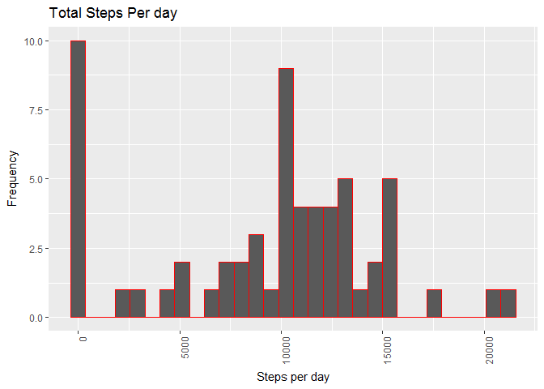
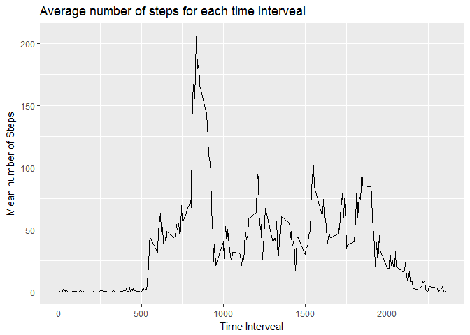
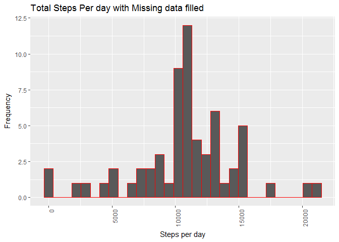
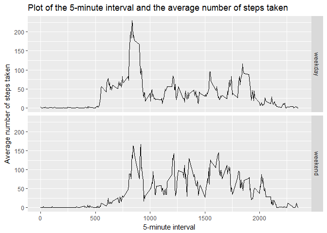

# Reproducible Research: Peer Assessment 1


## Loading and preprocessing the data
###Loading the necessary packages

```r
library(ggplot2)
library(plyr)
```

```
## Warning: package 'plyr' was built under R version 3.3.3
```

```r
library(Hmisc)
```

```
## Warning: package 'Hmisc' was built under R version 3.3.3
```

```
## Loading required package: lattice
```

```
## Warning: package 'lattice' was built under R version 3.3.3
```

```
## Loading required package: survival
```

```
## Warning: package 'survival' was built under R version 3.3.3
```

```
## Loading required package: Formula
```

```
## 
## Attaching package: 'Hmisc'
```

```
## The following objects are masked from 'package:plyr':
## 
##     is.discrete, summarize
```

```
## The following objects are masked from 'package:base':
## 
##     format.pval, round.POSIXt, trunc.POSIXt, units
```
###Loading the data

```r
activity<-read.csv("activity.csv",na.strings = "NA")
unique_dates<-unique(activity$date)
dim(activity)
```

```
## [1] 17568     3
```


## What is mean total number of steps taken per day?

###Total number of steps taken per day

```r
par(margin(4,1,4,1))
```

```
## NULL
```

```r
sum_steps<-tapply(X=activity$steps,INDEX=activity$date,FUN=sum,na.rm=TRUE)
total_steps<-data.frame(sum_steps=sum_steps,dates=unique_dates)

g<-ggplot(total_steps,aes(sum_steps))
g+geom_histogram(col="red")+theme(axis.text.x = element_text(angle = 90, hjust = 1))+xlab("Steps per day")+ylab("Frequency")+labs(title="Total Steps Per day")
```

```
## `stat_bin()` using `bins = 30`. Pick better value with `binwidth`.
```

<!-- -->

###Mean number of steps per day is 

```r
mean(total_steps$sum_steps,na.rm = TRUE)
```

```
## [1] 9354.23
```

###Median number of steps per day is


```r
median(total_steps$sum_steps,na.rm = TRUE)
```

```
## [1] 10395
```


## What is the average daily activity pattern?

###Plot of the 5-minute interval (x-axis) and the average number of steps taken, averaged across all days (y-axis)

```r
mean_interveal<-tapply(activity$steps,activity$interval,mean,na.rm=TRUE)
lab1<-names(mean_interveal)
lab1<-as.numeric(lab1)
mean_time_interveal<-data.frame(time_interveal=lab1,steps=mean_interveal)
g1<-ggplot(mean_time_interveal,aes(time_interveal,steps))
g1+geom_line()+xlab("Time Interveal")+ylab("Mean number of Steps")+labs(title="Average number of steps for each time interveal")
```

<!-- -->


```r
index<-which.max(mean_time_interveal[,2])

ti<-mean_time_interveal[index,1]
st<-mean_time_interveal[index,2]
```
###The time interveal with the maximum number of steps is 835 and the number of steps on average are 206.1698113


## Imputing missing values

###Reporting the total number of missing values in the dataset

```r
sum(!complete.cases(activity))
```

```
## [1] 2304
```
###Filling in all of the missing values in the dataset

```r
replacement<-aggregate(steps~interval,activity,mean,na.action=na.omit)$steps
```
###Creating a new dataset that is equal to the original dataset but with the missing data filled in.

```r
withNAFilled<-transform(activity,steps=ifelse(is.na(activity$steps),replacement,activity$steps))
```
###Histogram of the total number of steps taken each day

```r
sum_filled<-tapply(withNAFilled$steps,withNAFilled$date,sum)
time_steps_filled<-data.frame(time_inte_fil=unique_dates,steps=sum_filled)

g2<-ggplot(time_steps_filled,aes(steps))
g2+geom_histogram(col="red")+theme(axis.text.x = element_text(angle = 90, hjust = 1))+xlab("Steps per day")+ylab("Frequency")+labs(title="Total Steps Per day with Missing data filled")
```

```
## `stat_bin()` using `bins = 30`. Pick better value with `binwidth`.
```

<!-- -->

###Mean of the total number of steps with missing data filled in

```r
mean(time_steps_filled$steps)
```

```
## [1] 10766.19
```
###Median of the total number of steps with missing data filled in

```r
median(time_steps_filled$steps)
```

```
## [1] 10766.19
```

###Values of the mean and median differ significantly with the missing data filled in.Both the mean and median are higher with the missing data filled in.Further,the value of mean and median are same once the missing data is filled.


## Are there differences in activity patterns between weekdays and weekends?


```r
withNAFilled$date<-as.Date(as.factor(withNAFilled$date))
weekend<-c("Saturday","Sunday")
withNAFilled$day<-weekdays(withNAFilled$date)
withNAFilled<-transform(withNAFilled,isweekend=ifelse((withNAFilled$day %in% weekend),"weekend","weekday"))

weekday1<-subset(withNAFilled,subset = (isweekend == "weekday"))
mean_weekday<-tapply(weekday1$steps,weekday1$interval,mean)
unique_interveal<-unique(activity$interval)
weekday<-data.frame(meansteps=mean_weekday,interveal=unique_interveal)
weekday$type<-rep("weekday",times=nrow(weekday))

weekend1<-subset(withNAFilled,subset = (isweekend == "weekend"))
mean_weekend<-tapply(weekend1$steps,weekend1$interval,mean)
weekend<-data.frame(meansteps=mean_weekend,interveal=unique_interveal)
weekend$type<-rep("weekend",times=nrow(weekend))

day<-rbind(weekday,weekend)
day$type<-as.factor(day$type)
```

###Time series plot of the 5-minute interval and the average number of steps taken, averaged across all weekday days or weekend days


```r
g2<-ggplot(day,aes(interveal,meansteps))
g2+geom_line()+facet_grid(type ~ .)+xlab("5-minute interval")+ylab("Average number of steps taken")+labs(title="Plot of the 5-minute interval and the average number of steps taken")
```

<!-- -->
